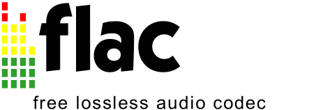

Custom LibFlac Build
--------------------

FLAC is a free and open source audio codec for lossless compression of
integer-based audio formats (often used to store CD audio, HD audio sold
online and movie audio tracks from Blu-Rays).

libflac is a C/C++ library that contains the reference encoder and
decoder for the format.

What's in this repository?
--------------------------

This `CMakeLists.txt` is a custom build that *blindly* assumes a modern
desktop Linux build environment / Windows Visual Studio environment
and skips all configure checks.

You should prefer the `CMakeLists.txt` that ships with libflac.

This one exists specifically for some of my "Nuclex" projects, where
I'm being pedantic about compiler settings. The `CMakeLists.txt` in this
repository takes all C/C++ compiler options from an external CMake include
file (`../../build-system/cmake/cplusplus.cmake`), thus making sure that
all libraries involved in my tools are compiled with the exact same compiler
settings and that i.e. PGO can be used from end to end.
